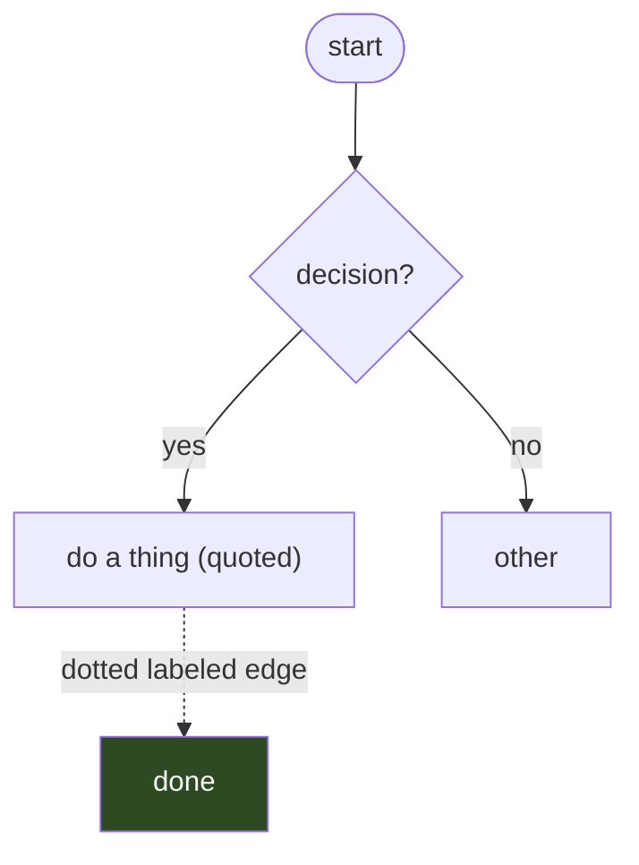
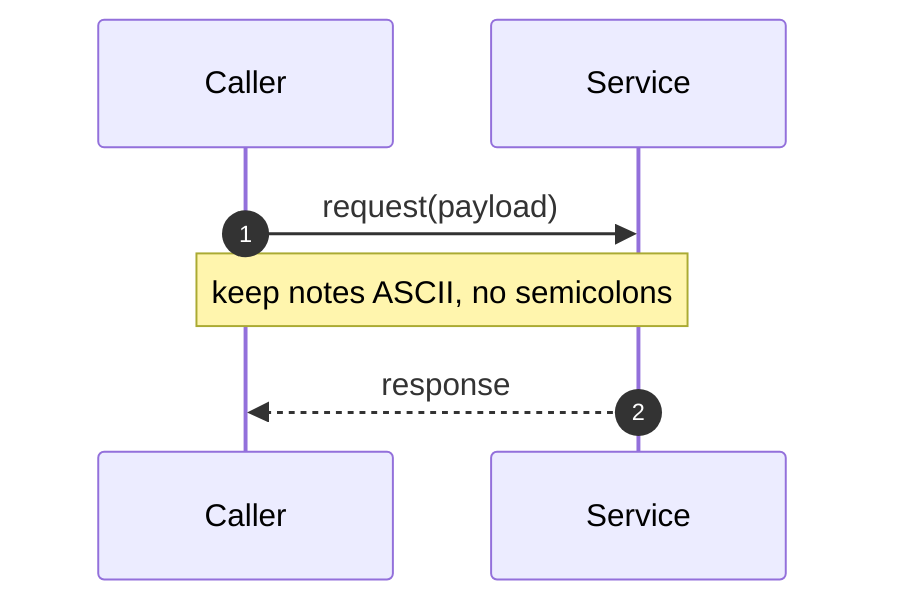

# Mermaid Reference & Rationale

Detailed backing for the rules in [SKILL.md](SKILL.md). Each entry names the
failure mode and the fix.

## Why these rules exist

Mermaid has a real grammar. Inside labels and notes, several characters are
*tokens*, not text. When they appear in human-written content the lexer/parser
fails — often with a misleading caret pointing a token or two past the real
cause.

### 1. Semicolon in a sequence note or message

```
%% BREAKS — ';' starts a new statement; the tail is parsed as a message
note right of B: rolls back its side; warren sees no burrow id
```
Error looks like: `Expecting 'SOLID_ARROW' ... got 'NEWLINE'` pointing at the
*next* line. Fix: use a comma, or two notes.
```
note right of B: rolls back its side, warren sees no burrow id
```

### 2. Inline edge-label text with punctuation

The documented `A -. text .-> B` (and `A -- text --> B`) forms work for *plain*
text, but `.`, `/`, `:`, `(` in the label collide with the edge terminator.
```
%% BREAKS — "seed.files" and "/" confuse the .-> terminator
Seed -. rides on POST /burrows seed.files .-> Post
```
Error: `Lexical error ... Unrecognized text`. Fix — pipe form with quotes,
which is robust to any punctuation:
```
Seed -.->|"rides on POST /burrows seed.files"| Post
A -->|"label (with punctuation): ok"| B
```

### 3. Raw angle brackets

`<ref>`, `<id>`, `<T>` are read as HTML. They silently vanish or error.
Exceptions: `<br>` / `<br/>` for line breaks are fine.
```
%% BREAKS or drops text
note over W,Git: checkout origin/<ref>
%% OK
note over W,Git: checkout origin/ref
A["generic List&lt;T&gt; here"]
```

### 4. Non-ASCII arrows / glyphs

`→ ← ⇒ ▷ ⊳ ◁ ⊲ ⟶ »` look nice but are rejected by stricter parsers and render
inconsistently across themes. Use ASCII words inside text:
```
%% Avoid:  provider = override ▷ default ▷ frontmatter
%% Use:    provider = override then default then frontmatter
```

### 5. Quote node labels with punctuation

Anything with `()`, `[]`, `{}`, `:`, `/`, `"`, `#` must be quoted so the
node-shape tokenizer doesn't trip:
```
%% BREAKS
A[detect branch (origin/HEAD)]
%% OK
A["detect branch (origin/HEAD)"]
```

### 6. Reserved words

`end` cannot be a node/participant id (it closes `subgraph`/`rect`/loop blocks).
Rename to `End_`, `Finish`, etc.

## Per-type quick cheatsheet

### flowchart


### sequenceDiagram


### state / class / er
Same rules: quote labels containing punctuation, keep text ASCII, avoid raw
angle brackets.

## Rendering targets

- **GitHub**: renders ```mermaid blocks natively in Markdown and PR previews.
- **VS Code**: needs the "Markdown Preview Mermaid Support" extension.
- **Authoritative local check**: install `@mermaid-js/mermaid-cli` (`mmdc`); the
  linter auto-detects it and does a true render-parse of every block.

## Style colors

`style Node fill:#hex,color:#fff` is tuned per theme. Dark fills with light text
read on both light and dark backgrounds; pure-light fills can wash out on dark.
</content>
